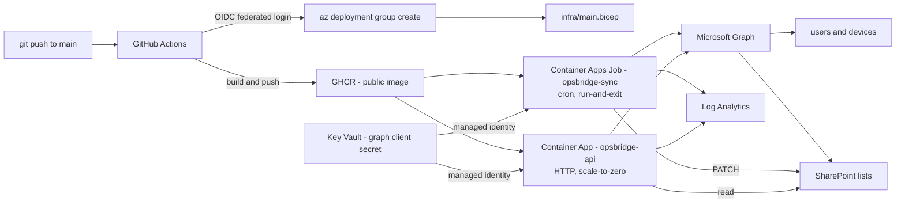

# OpsBridge365 — cloud layer

OpsBridge365 keeps an IT service desk's device inventory honest: a scheduled job
pulls users and devices from Microsoft Graph and writes them into a SharePoint
**Assets** list, and a small HTTP API reads the **Tickets** list and returns live
SLA numbers. It is packaged as one container image with two entrypoints, deployed
by one Bicep template, and designed to cost nothing while idle.

> **Deployment status, stated up front:** nothing in this repository is running in
> Azure. The Azure subscription, the Entra tenant, and the Microsoft 365 tenant it
> targets do not exist yet — they need a human to create accounts. The code, the
> container, the infrastructure template and the pipelines are written and, where
> they can be, verified locally. The [status table](#status) says exactly which is
> which, per component.

---

## The problem it solves

A service desk accumulates two recurring, boring, error-prone chores:

1. **Asset reconciliation.** The device inventory in SharePoint drifts from what
   the directory actually knows. Who is a laptop assigned to? Is it compliant?
   When did it last check in? Someone updates the list by hand, or nobody does.
2. **SLA visibility.** "How many tickets are open, how many are about to breach,
   and did we hit our targets last week?" is answered by opening a list and
   counting, or by a report that nobody runs.

OpsBridge365 automates both. The sync job reconciles Graph device data into the
Assets list on a cron. The API answers the SLA question over HTTP in one call.

Two deliberate honesty rules run through the whole thing, because a wrong value in
an asset register is worse than an admitted gap:

- A device matches an Assets row by **serial number first, then device name**. A
  key matching more than one row is ambiguous, so it matches **nothing**.
- When a value cannot be determined, the literal string `"Unknown"` is written —
  never a guess. An unknown `LastCheckIn` is a date column, so it is left
  untouched rather than stamped with an invented time, and the count of those
  appears in the job's JSON summary.

The same rule governs the metrics: `sla_compliance_7d_pct` returns `null` when
nothing was resolved in the window, rather than a misleading 0% or 100%.

---

## Architecture



One image, two entrypoints. The API runs the image's default `CMD` (uvicorn); the
job overrides it with `python -m app.sync`. One build, one push, two workloads.

Full component and data-flow detail, and the reasoning behind each choice, is in
[`docs/ARCHITECTURE.md`](docs/ARCHITECTURE.md).

---

## Quickstart

### Run the tests

```bash
pip install -e ".[dev]"
python -m pytest -q
```

Every test in the default run is offline — `httpx` is intercepted by `respx` and
MSAL is replaced by a stub, so no token request and no Graph call leaves the
machine. No credentials needed.

#### Live integration tests (opt-in)

`tests/integration/` holds ten tests that hit the real Microsoft 365 tenant.
They are **deselected by default** — `addopts = "-ra -m 'not integration'"` in
`pyproject.toml` — so a bare `python -m pytest` never reaches for a credential.
Opt in explicitly:

```bash
pytest -m integration      # only the live tests
pytest -m ""               # offline + live
```

They read every value from the environment; nothing tenant-specific is committed:

```bash
export AZURE_TENANT_ID=...        # the Microsoft 365 tenant, not the Azure one
export AZURE_CLIENT_ID=...
export AZURE_CLIENT_SECRET=...    # never commit this, never echo it
export SHAREPOINT_SITE_ID=...     # hostname,siteGuid,webGuid
export ASSETS_LIST_ID=...
export TICKETS_LIST_ID=...
```

With any of those unset each test **skips with a reason** rather than failing, so
the suite stays green on a machine with no credentials.

They are safe to re-run. Exactly one test writes — a PATCH round-trip on a single
Assets row — and it restores the original value in a `finally` block, so the
lists are left exactly as found. Two are negative tests: a wrong client secret
must raise `GraphAuthError`, and a request for a site the app was *not* granted
must return **403**. That 403 is the evidence that `Sites.Selected` is genuinely
scoped to one site rather than acting as tenant-wide SharePoint access.

### Run locally

```bash
cp .env.example .env      # fill in tenant, client, site and list ids
uvicorn app.main:app --reload --port 8000
python -m app.sync        # run the sync once, print a JSON summary, exit
```

### Run in Docker

```bash
docker build -t opsbridge365:local .

# API — starts and serves /healthz with no credentials at all
docker run --rm -p 8000:8000 opsbridge365:local
curl http://localhost:8000/healthz

# Sync job — same image, different command
docker run --rm --env-file .env opsbridge365:local python -m app.sync
```

`/healthz` answers `200` even with an empty environment, on purpose: a health
probe that needs secrets would have the orchestrator kill a container that is
merely unconfigured. `/metrics` — the endpoint that genuinely needs Graph
credentials — returns `503` instead, and names no variable to the caller.

### Verify everything at once

```powershell
powershell -NoProfile -File scripts/verify-opsbridge.ps1
```

A read-only report. It runs every check it can and reports the rest as **SKIP**,
never PASS — an unauthenticated run tells you exactly what it did *not* verify.

---

## Status

Honest, per component. Three categories, and nothing is promoted a category for
looking good.

| Component | Status | How that is known |
| --- | --- | --- |
| Graph client — auth, paging, 429/503 retry with `Retry-After` | ✅ **Implemented + tested locally** | 58 tests pass offline; `tests/test_graph.py` covers paging, throttling, timeout, malformed JSON |
| SharePoint client — list reads, asset PATCH | ✅ **Implemented + tested locally** | `tests/test_sharepoint.py` asserts the PATCH payload shape |
| Sync job (`python -m app.sync`) | ✅ **Implemented + tested locally** | `tests/test_sync.py`: ambiguous keys match nothing, unresolved values become `"Unknown"` |
| SLA metrics computation | ✅ **Implemented + tested locally** | `tests/test_metrics.py`: zero denominator returns `null`, not a fake percentage |
| FastAPI `/healthz` + `/metrics` | ✅ **Implemented + tested locally** | `tests/test_api.py`; also exercised in a real container |
| Container image (multi-stage, non-root uid 10001) | ✅ **Implemented + tested locally** | Built and run on this machine — [`evidence/docker/build-and-run.md`](evidence/docker/build-and-run.md) |
| Bicep template (`infra/main.bicep`) | 🟡 **Implemented, awaiting cloud credentials** | Compiles clean with Bicep CLI 0.46.1, zero diagnostics. **Never deployed** — no Azure subscription exists |
| SharePoint provisioning script | 🟡 **Implemented, awaiting cloud credentials** | `--dry-run` plan runs offline and is the automatic fallback with no credentials. Never run against a real site |
| Operator scripts (deploy / verify / destroy) | 🟡 **Implemented, awaiting cloud credentials** | `verify-opsbridge.ps1` runs end to end today and reports the cloud checks as SKIP. Deploy and destroy have never touched Azure |
| CI workflow (`ci.yml`) | 🟡 **Implemented, awaiting cloud credentials** | Written and reviewed. **Never executed** — this repository has no git remote, so no run exists on GitHub |
| Secret scanning (gitleaks, full history) | 🟡 **Implemented, verified locally** | `secret-scan` job in both workflows, hard gate on `build-and-push`. The scan itself was run locally over the full history (gitleaks v8.30.1, 6 commits) and is clean; the *job* has never run on GitHub |
| Deploy workflow (`deploy.yml`) | 🟡 **Implemented, awaiting cloud credentials** | Same — written, never run. OIDC federation cannot be configured without both accounts |
| Integration tests against a real tenant | 🟡 **Written, not yet executed here** | `tests/integration/test_live_graph.py` — 10 tests, opt-in via `pytest -m integration`. The machine these docs were written on has no credentials in its environment, so they have only been seen to collect and skip, never to pass. Nobody should read this row as "the live tenant is verified" |
| Azure subscription (Azure for Students) | ⛔ **Blocked on human account creation** | Student identity verification |
| Own Entra tenant + app registrations | ⛔ **Blocked on human account creation** | Portal tenant creation requires a signed-in human |
| Microsoft 365 E5 trial (adds SharePoint) | ⛔ **Blocked on human account creation** | Requires a payment method on file |
| GitHub account / repo / GHCR package | ⛔ **Blocked on human account creation** | `gh auth login` device code |
| Graph admin consent | ⛔ **Blocked on human account creation** | One global-admin click, after the tenant exists |
| Every Azure resource — Container Apps, Key Vault, Log Analytics | ⛔ **Blocked on human account creation** | Requires `az login` against a real subscription |
| Log Analytics failure alert, budget guardrail, cost verification | ⛔ **Blocked on human account creation** | Requires deployed resources to attach to |

**Test suite, re-run independently while writing these docs:**

```
$ python -m pytest -q
..........................................................               [100%]
58 passed, 10 deselected in 1.82s
```

The 10 deselected are the live integration tests (see Quickstart). The 58 that
ran needed no network and no credentials.

Two things this table deliberately does *not* claim: there is no measured cold
start time, no uptime figure, and no throughput number anywhere in this
repository, because nothing has run in Azure to measure. And `opsbridge-state.json`
is a build-tracking artifact that has drifted — it still marks Docker, Bicep and
the workflows `NOT_STARTED`, the test count as 56, and the integration tests
as blocked on a tenant that now exists. This table and the repo are
authoritative over it.

---

## Tech stack

| Layer | Choice |
| --- | --- |
| Language | Python 3.12 |
| API | FastAPI + uvicorn |
| HTTP / auth | httpx (async), MSAL client-credentials flow |
| Validation | Pydantic v2, pydantic-settings |
| Tests | pytest, pytest-asyncio, respx — 58 offline tests, plus 10 opt-in live tests |
| Lint | ruff (`E`, `F`, `I`, `UP`, `B`, line length 100) |
| Container | Multi-stage Dockerfile on `python:3.12-slim`, non-root uid 10001 |
| Infrastructure | Bicep, one file, resource-group scope |
| CI/CD | GitHub Actions, OIDC federated login, GHCR, gitleaks secret scan |
| Cloud | Azure Container Apps (Job + App), Key Vault, Log Analytics |
| Data | Microsoft Graph, SharePoint lists |

---

## Repo layout

```
app/                    the service
  config.py             env-driven settings; importing never raises
  graph.py              Graph client - auth, paging, retry/backoff
  sharepoint.py         list reads and asset PATCH, over graph.py
  sync.py               run-and-exit job entrypoint
  metrics.py            pure SLA computation, no I/O
  models.py             Pydantic models for Graph, lists, responses
  main.py               FastAPI app - /healthz, /metrics
tests/                  58 offline tests
  integration/          10 live tenant tests, deselected by default
infra/                  main.bicep + parameter example + infra/README.md
.github/workflows/      ci.yml (PR) and deploy.yml (main)
scripts/                deploy / verify / destroy + SharePoint provisioning
docs/                   architecture, security, cost, deployment, demo, evidence
evidence/               captured proof (see docs/EVIDENCE.md for what exists)
Dockerfile              multi-stage, non-root, HEALTHCHECK
```

## Documentation

| Document | What it covers |
| --- | --- |
| [`docs/ARCHITECTURE.md`](docs/ARCHITECTURE.md) | Components, data flow, the two-tenant split, job-vs-API and GHCR-vs-ACR decisions |
| [`docs/SECURITY.md`](docs/SECURITY.md) | Threat model, controls, Graph permissions, and the gaps |
| [`docs/COST.md`](docs/COST.md) | The $0-while-idle model, its assumptions, and what breaks it |
| [`docs/DEPLOYMENT.md`](docs/DEPLOYMENT.md) | End-to-end runbook, secrets table, the human steps |
| [`docs/DEMO.md`](docs/DEMO.md) | A 5-minute interview demo, with an offline fallback |
| [`docs/EVIDENCE.md`](docs/EVIDENCE.md) | What has been proven, how, and what has not |
| [`docs/INTERVIEW-NOTES.md`](docs/INTERVIEW-NOTES.md) | Likely questions and honest answers |
| [`infra/README.md`](infra/README.md) | Per-resource breakdown of the Bicep template |
| [`docs/SPEC-cloud-v2-AUTHORITATIVE.md`](docs/SPEC-cloud-v2-AUTHORITATIVE.md) | The design brief this was built against |

**Scope note.** This repository is the *cloud layer*. The spec also describes a
Power Platform service desk (Power Apps, SharePoint lists, Power Automate flows)
living in a separate tenant; none of that is in this repo, and nothing here
claims it is built.
