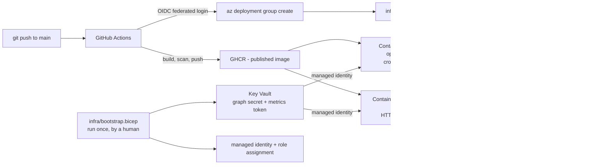

# OpsBridge365

**A deployed Microsoft 365 / Azure operations service that reconciles Graph device data into SharePoint and exposes service-desk SLA metrics.**

| | |
| --- | --- |
| **Stack** | Python 3.12 · FastAPI · Microsoft Graph · SharePoint · Azure Container Apps · Bicep · Key Vault · GitHub Actions + OIDC |
| **Proof** | 106 offline tests + 12 opt-in tests against a real tenant · deployed by passwordless CI/CD · scale-to-zero |
| **Live** | [`/healthz`](https://opsbridge-api.purplewave-d90933e8.westus2.azurecontainerapps.io/healthz) · [`/demo/metrics`](https://opsbridge-api.purplewave-d90933e8.westus2.azurecontainerapps.io/demo/metrics) — both public. `/metrics` returns live tenant data and needs a token |
| **One measured result** | The cloud sync job read Graph and wrote the live SharePoint list: **1 confident match written, 3 honest `Unknown`s** — it refused to guess rather than filling the register with plausible-looking data |

[](https://github.com/Alhamwis/OpsBridge365/actions/workflows/ci.yml)
[](https://github.com/Alhamwis/OpsBridge365/actions/workflows/deploy.yml)
[](https://github.com/Alhamwis/OpsBridge365/actions/workflows/health.yml)
[](.github/workflows/ci.yml)
[](LICENSE)

**[Architecture](docs/ARCHITECTURE.md)** · **[Demo](docs/DEMO.md)** · **[Security](docs/SECURITY.md)** · **[Evidence](docs/EVIDENCE.md)** · **[Deployment runbook](docs/DEPLOYMENT.md)** · **[Current status](docs/STATUS.md)**

```bash
BASE=https://opsbridge-api.purplewave-d90933e8.westus2.azurecontainerapps.io
curl -s "$BASE/healthz"        # {"status":"ok","version":"0.1.0"}
curl -s "$BASE/demo/metrics"   # synthetic sample data, no token needed
```

> **Read the dates.** Every measurement in this repository is stamped with when
> it was taken. A number without a date is a number nobody has checked. The
> live-service claims here were re-verified on **2026-08-29**; anything older is
> labelled **historical evidence** and lives in [`evidence/`](evidence/).

---

## The problem it solves

A service desk accumulates two recurring, boring, error-prone chores:

1. **Asset reconciliation.** The device inventory in SharePoint drifts from what
   the directory actually knows. Who is a laptop assigned to? Is it compliant?
   When did it last check in? Someone updates the list by hand, or nobody does.
2. **SLA visibility.** "How many tickets are open, how many are about to breach,
   and did we hit our targets last week?" is answered by opening a list and
   counting, or by a report that nobody runs.

OpsBridge365 automates both. The sync job reconciles Graph device data into the
Assets list on a cron. The API answers the SLA question over HTTP in one call.

Two deliberate honesty rules run through the whole thing, because a wrong value in
an asset register is worse than an admitted gap:

- A device matches an Assets row by **serial number first, then device name**. A
  key matching more than one row is ambiguous, so it matches **nothing**.
- When a value cannot be determined, the literal string `"Unknown"` is written —
  never a guess. An unknown `LastCheckIn` is a date column, so it is left
  untouched rather than stamped with an invented time, and the count of those
  appears in the job's JSON summary.

The same rule governs the metrics: `sla_compliance_7d_pct` returns `null` when
nothing was resolved in the window, rather than a misleading 0% or 100%. That is
not hypothetical — it is what the live endpoint returns today, because the
7-day window has rolled past the seeded resolutions.

---

## Architecture



One image, two entrypoints. The API runs the image's default `CMD` (uvicorn); the
job overrides it with `python -m app.sync`. One build, one push, two workloads.

The **bootstrap / routine split** is the load-bearing security decision. Anything
needing a privilege the pipeline should not hold permanently — creating a role
assignment, writing a secret value — lives in `infra/bootstrap.bicep` and is run
deliberately by a person. The routine pipeline holds **Contributor and nothing
more**, and never sees a secret value. See
[`docs/ARCHITECTURE.md`](docs/ARCHITECTURE.md) and
[`docs/SECURITY.md`](docs/SECURITY.md).

---

## The three endpoints, and why they differ

| Endpoint | Auth | Upstream calls | Purpose |
| --- | --- | --- | --- |
| `GET /healthz` | none | none | Liveness. Answers even with no configuration, because a probe that needs secrets makes the orchestrator kill a container that is merely unconfigured |
| `GET /demo/metrics` | none | none | The shape of the API, with **synthetic** data. Labelled `"synthetic": true` in the body, not just a header, because a screenshot keeps the body and drops the headers |
| `GET /metrics` | **Bearer token** | at most one per 45s | Live tenant numbers |

`/metrics` used to be public. Every anonymous request built a new MSAL
application, acquired a token and read a live SharePoint list — so one cheap HTTP
request became several upstream calls, real ticket counts were world-readable,
and a loop could both throttle Microsoft Graph and hold a scale-to-zero container
permanently awake. It is now authenticated, rate limited (30/min per caller),
served from a 45-second cache that collapses concurrent misses into a single
upstream fetch, and bounded by a wall-clock deadline.

```bash
# 401 without a token
curl -s -o /dev/null -w '%{http_code}\n' "$BASE/metrics"

# 200 with one
curl -s -H "Authorization: Bearer $METRICS_API_TOKEN" "$BASE/metrics"
```

The token is a static bearer credential held in Key Vault, not a short-lived
Entra token. That trade-off is deliberate and is argued in
[`docs/SECURITY.md`](docs/SECURITY.md), along with the upgrade path.

---

## Quickstart

### Run the tests

```bash
pip install --require-hashes --no-deps -r requirements-dev.txt
pip install --no-deps -e .
python -m pytest -q
```

Every test in the default run is offline — `httpx` is intercepted by `respx` and
MSAL is replaced by a stub, so no token request and no Graph call leaves the
machine. No credentials needed.

Dependencies install from a **hash-pinned lock**, not from the `>=` floors in
`pyproject.toml`, so CI, the container and your laptop resolve to the same set.
Regeneration instructions are in [`docs/DEPLOYMENT.md`](docs/DEPLOYMENT.md).

#### Live integration tests (opt-in)

`tests/integration/` holds twelve tests that hit the real Microsoft 365 tenant.
They are **deselected by default** — `addopts = "-ra -m 'not integration'"` in
`pyproject.toml` — so a bare `python -m pytest` never reaches for a credential.

```bash
pytest -m integration      # only the live tests
pytest -m ""               # offline + live
```

They read every value from the environment; nothing tenant-specific is committed.
With any variable unset each test **skips with a reason** rather than failing, so
the suite stays green on a machine with no credentials.

They are safe to re-run. Exactly one test writes — a PATCH round-trip on a single
Assets row — and it restores the original value in a `finally` block. Several are
negative tests: a wrong client secret must raise `GraphAuthError`, and *data* on a
site the app was never granted plus both tenant-wide enumeration paths must all
return **403**. Those 403s are the evidence that `Sites.Selected` is genuinely
scoped to one site. Note what they deliberately do *not* assert: an ungranted
site's **metadata** is readable and returns 200, which is expected Microsoft
behaviour — see
[`docs/SECURITY.md`](docs/SECURITY.md#what-sitesselected-does-and-does-not-hide).

### Run locally

```bash
cp .env.example .env      # fill in tenant, client, site and list ids
uvicorn app.main:app --reload --port 8000
python -m app.sync        # run the sync once, print a JSON summary, exit
```

Leaving `METRICS_API_TOKEN` unset does **not** make `/metrics` public — it
returns `503`. A misconfiguration must not silently reopen the hole the
authentication closes.

### Run in Docker

```bash
docker build -t opsbridge365:local .
docker run --rm -p 8000:8000 opsbridge365:local
curl http://localhost:8000/healthz
```

### Verify everything at once

```powershell
powershell -NoProfile -File scripts/verify-opsbridge.ps1
```

A read-only report. It runs every check it can and reports the rest as **SKIP**,
never PASS — an unauthenticated run tells you exactly what it did *not* verify.

---

## Status

Two tables, deliberately separated. The first is what was **re-measured on
2026-08-29**. The second is **historical evidence** — real, captured, and not
re-checked since. Merging them is how a repository ends up claiming a service is
healthy because it was healthy in August.

[`docs/STATUS.md`](docs/STATUS.md) holds the same split with the commands used.

### Currently verified — 2026-08-29

| Component | Status | Evidence |
| --- | --- | --- |
| **Live API** | ✅ Up | `GET /healthz` → **200** `{"status":"ok","version":"0.1.0"}` |
| **Cold start** | ✅ Measured | **20.2 s** cold, **248 ms** warm. The replica count was observed at **0** immediately before the probe, so this is a genuine scale-from-zero. An earlier figure of 714 ms is in the git history and was **wrong** — it cannot have been taken against a sleeping app. Two runs today gave 21.3 s and 20.2 s |
| **Public demo endpoint** | ✅ Up | `GET /demo/metrics` → **200**, `"synthetic": true`, no upstream call |
| **`/metrics` is closed** | ✅ Verified | `GET /metrics` with no token → **401** |
| **Live SLA metrics** | ✅ Up | With a token → **200**, computed from live SharePoint |
| **Scale to zero** | ✅ Verified | `minReplicas: 0`. Active replica count observed at **0** while idle — the same observation the cold start above depends on |
| **Scheduled sync job** | ✅ Verified | `triggerType: Schedule`, cron `0 */6 * * *`, `replicaRetryLimit: 1`, `replicaTimeout: 1800` |
| **Azure resources** | ✅ Live | 8 resources in `rg-opsbridge365` (westus2): Log Analytics, managed identity, Key Vault, Container Apps environment, Job, App, action group, alert rule |
| **Least privilege, demonstrated** | ✅ Verified | Key Vault denies the **human operator** with `ForbiddenByRbac`. Only the managed identity holds Key Vault Secrets User |
| **Offline test suite** | ✅ Verified | **106 passed**, 12 deselected, no credentials and no network |
| **Lint** | ✅ Verified | `ruff check .` — all checks passed, and it is a **hard CI gate** |
| **Secret scanning** | ✅ Verified | gitleaks over the **full history** — **0 findings**. Re-run with the project allowlist pointed away, it finds exactly **2**, and both are public Microsoft built-in role definition GUIDs that grant nothing. That is the allowlist earning its place rather than hiding something — [`docs/SECURITY.md`](docs/SECURITY.md) has both commands |
| **M365 subscription** | ⚠️ Trial | `O365_BUSINESS_PREMIUM`, `isTrial: true`, lifecycle date **2026-09-16**. See below |

### Historical evidence — captured 2026-08-18, not re-checked

| What was proven | Where |
| --- | --- |
| **End-to-end reconciliation.** The cloud job read Graph and wrote the live Assets list: `users_fetched 1, devices_fetched 1, assets_fetched 4, matched 1, patched 1, unknown_last_check_in 1` | [`evidence/sharepoint/reconciliation.md`](evidence/sharepoint/reconciliation.md) |
| **The schedule fires by itself.** Cron was temporarily set to `*/5`; an execution started at `09:05:00Z` by Azure's scheduler with no human or local involvement, and succeeded. Production cron restored and read back | [`evidence/azure/deployment.md`](evidence/azure/deployment.md) |
| **Failure alerting — and the defect testing found.** The first version of the alert query returned **0 hits against a genuinely failed job**: it matched `config_error` while the real failure emitted `graph_error`. Corrected, it returns 2 | [`evidence/monitoring/alerting.md`](evidence/monitoring/alerting.md) |
| **`Sites.Selected` boundary probed.** Ungranted-site *data* → 403, tenant-wide enumeration → 403, ungranted-site *metadata* → 200 (expected Microsoft behaviour, documented rather than overclaimed) | [`evidence/security/posture.md`](evidence/security/posture.md) |
| **Live integration suite.** 12 passed against the real tenant | [`evidence/graph/live-integration-run.md`](evidence/graph/live-integration-run.md) |
| **Cost.** Observed spend **$0.00** against a running deployment, on a subscription then hours old | [`evidence/cost/observed.md`](evidence/cost/observed.md) |

### ⚠️ One dated action, not automatable

The Microsoft 365 tenant runs on an **O365_BUSINESS_PREMIUM trial** — Graph
reports `isTrial: true` with a `nextLifecycleDateTime` of **2026-09-16**. Before
that date, turn off recurring billing in the Microsoft 365 admin center
or it converts to paid. Microsoft exposes no supported Graph or CLI API for
this, so it cannot be scripted. The exact path, checked against Microsoft's
current documentation:

1. Microsoft 365 admin center → **Billing** (Simplified view), or
   **Billing → Your products** (Dashboard view)
2. Select the OpsBridge365 subscription
3. **Edit recurring billing** → **Off** → **Save**

Turning recurring billing off does **not** cancel anything: the subscription
stays active until it expires, so the tenant, the SharePoint site and the Graph
identity keep working until then. That is the difference between this and
*Cancel subscription*, which takes effect immediately.

If it lapses, `/healthz` and `/demo/metrics` keep working and `/metrics` starts
returning `502` — honestly failing rather than serving stale numbers as if they
were live. Nothing in this README claims live Graph integration that has not
been re-verified. The Azure side is unaffected: different tenant, $0.00.

### Known gaps — not done

| Gap | Why it matters |
| --- | --- |
| **No uptime figure** | The scheduled health check runs every 4 hours. Six probes a day cannot measure availability to a percentage, so none is published. The run history is the evidence |
| **Cost is not proven over a billing cycle** | `$0.00` is real and was observed on a subscription hours old. One full month at this configuration is what would turn arithmetic into evidence |
| **The end-to-end run was one user and one device** | The matching and paging rules are covered by offline tests, but nothing here has met a real fleet, real Graph throttling at volume, or a large list |
| **`/metrics` uses a static bearer token** | Weaker than short-lived Entra tokens. Rotation is a Key Vault update plus a revision restart. The trade-off and upgrade path are in [`docs/SECURITY.md`](docs/SECURITY.md) |
| **Rate limiting is per replica** | In-process counters. Correct at `maxReplicas: 1`; it becomes per-replica the moment the service scales out, and the docstring says so |
| **Key Vault allows public network access** | Private endpoints and a vault firewall are the production answer; neither is free |
| **Teardown never exercised** | `destroy-cloud.ps1` is written and preflight-checked, and has not been run against the live resource group |

### How it got here — four real failures

The deploy did not work first time. Earlier runs failed for genuinely different
reasons, none of them a code defect, and each is written up with its fix in
[`docs/DEPLOYMENT.md`](docs/DEPLOYMENT.md#things-that-will-bite-you):

1. **`AADSTS700213`** — the deploy job is environment-gated, so GitHub presents
   `...:environment:production`, not `...:ref:refs/heads/main`.
2. **`AADSTS700213` again** — this account's GitHub default subject is
   **ID-qualified**. `use_default` was already `true`, so there was nothing to
   normalise; Entra has to match the ID-qualified string. That form is
   rename-proof, which is a security improvement rather than a workaround.
3. **`RequestDisallowedByAzure`** — Azure for Students enforces an
   allowed-regions policy. `eastus` is not allowed; the resource group was
   recreated in `westus2`.
4. **`MissingSubscriptionRegistration`** — five resource providers were
   unregistered on a fresh subscription.

`bicep build` returned zero diagnostics throughout. The template was never the
problem — every failure lived between the repository and one specific real
subscription, which is the argument for deploying rather than reasoning about
deploying.

---

## Tech stack

| Layer | Choice |
| --- | --- |
| Language | Python 3.12 |
| API | FastAPI + uvicorn |
| HTTP / auth | httpx (async), MSAL client-credentials flow |
| Validation | Pydantic v2, pydantic-settings |
| Tests | pytest, pytest-asyncio, respx — 106 offline tests, plus 12 opt-in live tenant tests |
| Lint | ruff (`E`, `F`, `I`, `UP`, `B`, line length 100) — a hard CI gate |
| Dependencies | hash-pinned lock generated from `pyproject.toml`; Dependabot proposes bumps |
| Container | Multi-stage Dockerfile on `python:3.12-slim` **pinned by digest**, non-root uid 10001 |
| Supply chain | Every GitHub Action pinned to a commit SHA · CodeQL · Trivy (filesystem + image) · SBOM (SPDX) |
| Infrastructure | Bicep — `bootstrap.bicep` (once, privileged) + `main.bicep` (routine, Contributor only) |
| CI/CD | GitHub Actions, OIDC federated login, GHCR, gitleaks over every commit on every ref (`--log-opts="--all"`) |
| Cloud | Azure Container Apps (Job + App), Key Vault, Log Analytics |
| Data | Microsoft Graph, SharePoint lists |

---

## Repo layout

```
app/                    the service
  config.py             env-driven settings; importing never raises
  graph.py              Graph client - auth, paging, retry/backoff
  sharepoint.py         list reads and asset PATCH, over graph.py
  sync.py               run-and-exit job entrypoint
  metrics.py            pure SLA computation, no I/O
  cache.py              TTL cache with single-flight coalescing
  ratelimit.py          sliding-window limiter, per caller
  security.py           bearer auth for /metrics; fails closed
  demo.py               synthetic payload for the public demo endpoint
  models.py             Pydantic models for Graph, lists, responses
  main.py               FastAPI app - /healthz, /demo/metrics, /metrics
tests/                  106 offline tests
  integration/          12 live tenant tests, deselected by default
infra/                  bootstrap.bicep, main.bicep, parameter example, README
.github/workflows/      ci.yml (PR), deploy.yml (main), health.yml (scheduled)
scripts/                deploy / verify / destroy + SharePoint provisioning
docs/                   architecture, security, cost, deployment, demo, status
evidence/               captured proof (see docs/EVIDENCE.md for what exists)
requirements.txt        hash-pinned runtime lock
requirements-dev.txt    hash-pinned runtime + dev lock
Dockerfile              multi-stage, digest-pinned base, non-root, HEALTHCHECK
```

## Documentation

| Document | What it covers |
| --- | --- |
| [`docs/ARCHITECTURE.md`](docs/ARCHITECTURE.md) | Components, data flow, the two-tenant split, the bootstrap/routine privilege split, job-vs-API and GHCR-vs-ACR decisions |
| [`docs/SECURITY.md`](docs/SECURITY.md) | Threat model, controls, Graph permissions, the `/metrics` auth trade-off, and the gaps |
| [`docs/STATUS.md`](docs/STATUS.md) | What is verified right now, what is historical, and the command behind each claim |
| [`docs/COST.md`](docs/COST.md) | The $0-while-idle model, its assumptions, and what breaks it |
| [`docs/DEPLOYMENT.md`](docs/DEPLOYMENT.md) | End-to-end runbook, the one-time bootstrap, and **[things that will bite you](docs/DEPLOYMENT.md#things-that-will-bite-you)** |
| [`docs/DEMO.md`](docs/DEMO.md) | A 5-minute interview demo, with an offline fallback |
| [`docs/EVIDENCE.md`](docs/EVIDENCE.md) | Index of the files under `evidence/` — what was proven, how, and what has not been |
| [`docs/INTERVIEW-NOTES.md`](docs/INTERVIEW-NOTES.md) | Likely questions and honest answers |
| [`infra/README.md`](infra/README.md) | Per-resource breakdown of the Bicep templates |
| [`.github/SECURITY.md`](.github/SECURITY.md) | How to report a vulnerability |

**Scope note.** This repository is the *cloud layer*: the sync job and the
metrics API. A Power Platform service desk (Power Apps, Power Automate flows)
was part of the original brief and is **not** in this repository; nothing here
claims it is built.

---

## Development transparency

OpsBridge365 was designed, deployed and verified by Saif Eddine Al Hamwi with
AI-assisted development tools. All architecture, security and operational claims
are backed by reproducible tests or captured cloud evidence.

## License

[MIT](LICENSE) © 2026 Saif Eddine Al Hamwi
