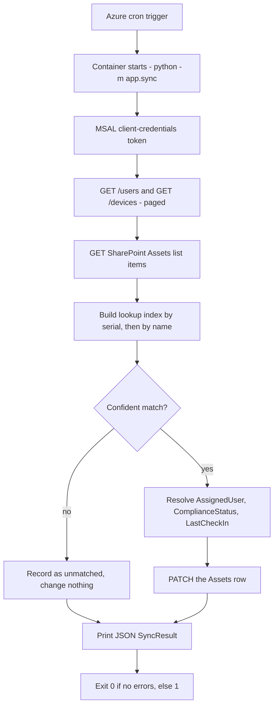
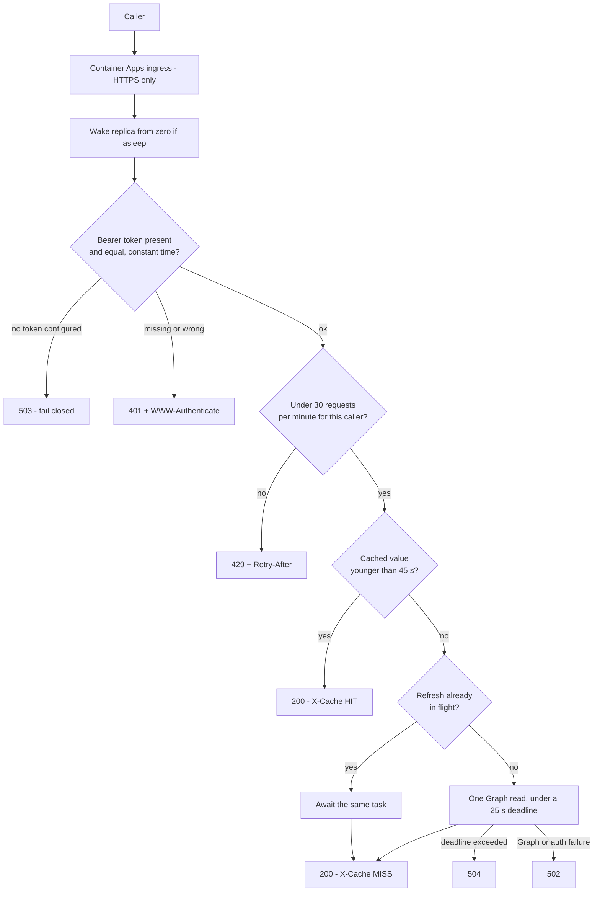
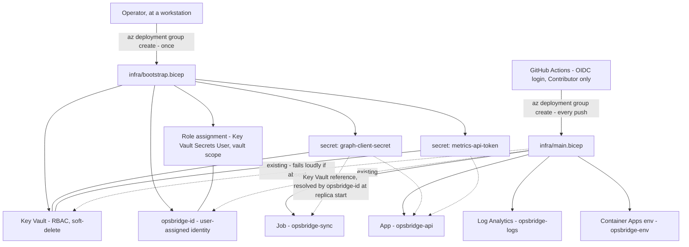

# Architecture

How OpsBridge365's cloud layer is put together, and why each choice was made.

> **The topology below is real.** Verified **2026-08-29**: `rg-opsbridge365`
> (**westus2**) holds eight resources — Log Analytics `opsbridge-logs`, the
> user-assigned identity `opsbridge-id`, the Key Vault, the Container Apps
> environment `opsbridge-env`, the `opsbridge-sync` Job, the `opsbridge-api` App,
> the `opsbridge-alerts` action group and the `opsbridge-sync-failed` alert rule.
> The API answers at
> `https://opsbridge-api.purplewave-d90933e8.westus2.azurecontainerapps.io`, and
> the sync job has executed on its cron and written a live SharePoint list. So
> where this document names an Azure resource in the present tense, that is
> literal.
>
> Deploy provenance is deliberately **not** pinned to a run id here — the newest
> green run of the deploy workflow is what is running, and the
> [run list](https://github.com/Alhamwis/OpsBridge365/actions/workflows/deploy.yml)
> is the one place that stays correct. Measured values and the exact command
> behind each one are in [`STATUS.md`](STATUS.md); the
> [status table](../README.md#status) is the short version.

---

## Components

| # | Component | Where it lives | What it does |
| --- | --- | --- | --- |
| 1 | `app/config.py` | in the image | Environment-driven settings. Importing it never raises — validation happens on first `get_settings()` call, so tests and `--help`-style imports work with a completely empty environment |
| 2 | `app/graph.py` | in the image | The only thing that talks to Microsoft Graph: MSAL client-credentials auth, `@odata.nextLink` paging, retry/backoff, a per-request timeout and a page ceiling. MSAL is synchronous, so token acquisition is awaited off the event loop |
| 3 | `app/sharepoint.py` | in the image | Thin wrapper over #2 for list reads and asset PATCH. Deliberately owns no auth, paging or retry logic of its own |
| 4 | `app/sync.py` | Container Apps **Job** | Run-and-exit entrypoint. Fetches, matches, PATCHes, prints a JSON summary, exits with a status code |
| 5 | `app/metrics.py` | Container App (API) | Pure function over ticket rows — no I/O, so it is trivially testable |
| 6 | `app/security.py` | Container App (API) | Bearer authentication and rate-limit admission for `/metrics`. Fails closed |
| 7 | `app/ratelimit.py` | Container App (API) | Sliding-window limiter, per caller, in-process |
| 8 | `app/cache.py` | Container App (API) | Single-slot TTL cache with single-flight coalescing |
| 9 | `app/demo.py` | Container App (API) | The synthetic payload behind the public `/demo/metrics` endpoint |
| 10 | `app/main.py` | Container App (API) | FastAPI surface: `GET /healthz`, `GET /demo/metrics`, `GET /metrics` |
| 11 | `infra/bootstrap.bicep` | Azure ARM | **Run once, by a human.** Key Vault, the managed identity, the one role assignment, and the secret *values* |
| 12 | `infra/main.bicep` | Azure ARM | **Routine, every push.** Log Analytics, the environment, the Job and the App. References #11's resources as `existing` |
| 13 | `.github/workflows/` | GitHub | `ci.yml` on pull requests; `deploy.yml` on push to `main`; `health.yml` on a 4-hour schedule |

### The Azure resources, and which template owns each

Created **once**, by `infra/bootstrap.bicep`, from an operator's workstation:

| Resource | Name | Role |
| --- | --- | --- |
| Key Vault (RBAC, soft-delete on, standard SKU) | `opsbridgekv<hash>` | Holds exactly two secrets: `graph-client-secret` and `metrics-api-token` |
| User-assigned managed identity | `opsbridge-id` | Shared by both workloads. Its only permission anywhere in Azure is *read secret values from that vault* |
| Role assignment | Key Vault Secrets User, vault scope | The single line of authorisation in the whole system, and the reason the bootstrap template exists at all |

Created on **every push**, by `infra/main.bicep`:

| Resource | Name | Role |
| --- | --- | --- |
| Log Analytics workspace | `opsbridge-logs` | stdout/stderr from both containers, plus job execution history. 30-day retention |
| Container Apps environment | `opsbridge-env` | The runtime both workloads live in |
| Container Apps **Job** | `opsbridge-sync` | `triggerType: Schedule`, cron `0 */6 * * *` UTC, `replicaTimeout` 1800s, `replicaRetryLimit` 1 |
| Container **App** | `opsbridge-api` | External HTTPS ingress on port 8000, `minReplicas: 0`, `maxReplicas: 1`, HTTP scale rule at 20 concurrent requests |

Created **out of band**, with the Azure CLI, and not declared in either template:

| Resource | Name | Role |
| --- | --- | --- |
| Action group | `opsbridge-alerts` | Email target for the alert below |
| Scheduled query rule | `opsbridge-sync-failed` | Fires on a failed sync execution. Its first version matched a status the app never emits on that path, which is why it was tested by a controlled failure rather than by inspection — see [`STATUS.md`](STATUS.md) |

That last pair is a real gap rather than a design choice: everything else in the
resource group is reproducible by one command, and the alerting is not. It was
built and tested with the CLI and never moved into Bicep.

Both containers run at 0.25 vCPU / 0.5 GiB. The cost model those numbers feed is
in [`COST.md`](COST.md).

---

## Data flow: the sync job, every 6 hours



The matching step is where the design opinion lives. `build_asset_index` indexes
Assets rows by normalised serial number and by normalised device name; any key
that maps to two different rows is recorded as **ambiguous and removed from the
index entirely**, so it matches nothing. `AssetIndex.lookup` tries serial first,
then name. A device Graph reports without a `serialNumber` property is still
matched if the serial hides in `physicalIds` as `[SerialNumber]:ABC123`, which is
where Graph often puts it.

The rule underneath all of that: **a wrong match is worse than an admitted gap.**
Everything the sync could not determine is counted and surfaced in the exit
summary — `unmatched_devices`, `unknown_assigned_user`, `unknown_compliance`,
`unknown_last_check_in`. A PATCH failure is appended to `errors`, the loop
continues, and a non-empty `errors` list makes the process exit `1`.

---

## The three endpoints, and why they differ

| Endpoint | Auth | Upstream calls | Exists for |
| --- | --- | --- | --- |
| `GET /healthz` | none | none | Liveness. It answers on a container with no configuration at all, because a probe that needs secrets makes the orchestrator kill a container that is merely unconfigured |
| `GET /demo/metrics` | none | none | The *shape* of the API, with synthetic data. `"synthetic": true` is in the response **body**, not only a header, because a screenshot keeps the body and drops the headers |
| `GET /metrics` | **bearer token** | at most one per 45 s | Live tenant numbers |

The split is the point. Anything a stranger needs — is it up, what does it
return — is public and costs nothing to serve. The one endpoint that discloses
real operational data and reaches a real tenant is the one endpoint behind a
credential.

---

## The `/metrics` request path

`/metrics` used to be public and uncached. Every anonymous request built a new
MSAL application, acquired a token and read a live SharePoint list, so one cheap
HTTP request became several upstream calls. Three things were wrong with that at
once: real ticket counts were world-readable, a loop could amplify into Microsoft
Graph throttling, and the same loop could hold a scale-to-zero container
permanently awake and billing.

The fix is layered, and each layer stops something the next one cannot.



| Layer | Implemented in | What it stops | What the caller gets |
| --- | --- | --- | --- |
| **Fail-closed configuration check** | `app/security.py` | A missing `METRICS_API_TOKEN` silently reopening the endpoint. An unconfigured service refuses; it never falls back to serving data | `503` |
| **Bearer token, constant-time compare** | `app/security.py` | Anonymous disclosure of real ticket counts, and anonymous amplification into Graph | `401` with `WWW-Authenticate: Bearer` |
| **Sliding-window rate limit, 30/min per caller** | `app/ratelimit.py` | An *authenticated* caller looping fast enough to force cache misses, throttle Graph, or keep the replica awake | `429` with `Retry-After` |
| **45-second cache** | `app/cache.py` | Repeat reads reaching SharePoint at all. N callers inside one window cost one upstream read | `200`, `X-Cache: HIT`, `Cache-Control: private, max-age=<remaining>` |
| **Single flight** | `app/cache.py` | The cache stampede a plain TTL cache still allows: a burst that all misses at the same instant issuing N simultaneous Graph reads | `200`, `X-Cache: MISS`, served from the one shared fetch |
| **25-second wall-clock deadline** | `app/main.py` | An unbounded aggregate. `app/graph.py` bounds each individual request; nothing bounded a deeply paged read as a whole, so a caller's connection could be held for minutes | `504` |

Five details in that list are load-bearing and easy to get backwards:

- **Authentication runs before rate limiting.** Otherwise an unauthenticated
  flood consumes the limiter budget of a legitimate caller sharing an egress
  address — the attacker gets to deny service to the person paying for it.
- **Waking the replica happens above the application.** The ingress starts a
  sleeping container before any of these layers run, so an anonymous request
  still causes a cold start; the `401` is issued by the app once it is up. What
  authentication stops is the disclosure and the Graph read, not the wake.
  Bounding the wake itself would need something in front of the container app,
  which is a cost this architecture deliberately does not carry.
- **The caller key is the left-most `X-Forwarded-For` entry.** Container Apps
  terminates TLS, so `request.client` is the ingress and would bucket the entire
  internet together. That key is used for limiting and for audit lines only; it
  is never returned to a caller.
- **The limit is per replica**, because the counters are in-process. That is the
  whole fleet at `maxReplicas: 1`, and it becomes per-replica the moment the
  service scales out. Rate-limiting one container with Redis would cost more
  than the thing it protects; the docstring in `app/ratelimit.py` is the warning
  label.
- **A failed refresh is not cached.** The exception propagates to every caller
  waiting on that flight and the next request retries, so a transient Graph
  failure cannot be frozen into the cache for 45 seconds.

Errors are generic — `Upstream Microsoft Graph request failed.`, not the Graph
response. The detail goes to the log as a structured audit line
(`metrics_auth caller=… outcome=denied reason=invalid_token`) that contains no
secret and no token material.

### The trade-off in the token itself

The credential is a **static bearer token** held in Key Vault as
`metrics-api-token` and injected exactly like the Graph client secret. That is
weaker than short-lived Entra tokens, and it is the honest description: it does
not expire on its own, and rotation is a manual act — update the Key Vault
secret, restart the revision.

Container Apps' built-in Entra authentication (EasyAuth) was considered and not
chosen. It validates tokens in the platform, *above* this process, so none of the
behaviours in the table above — the 401, the 429, the cache-hit accounting —
could be proven by the offline test suite; they would become properties of a
configuration nobody in this repository can assert. It also needs a second app
registration in a college-managed tenant, and it would make the endpoint
impossible to demonstrate without an Azure CLI session. The upgrade path is
recorded in [`SECURITY.md`](SECURITY.md).

### The numbers `/metrics` returns

Exactly as `app/metrics.py` computes them:

- **`open_tickets`** — every ticket whose `Status` is not `Resolved`
  (case-insensitive, whitespace-trimmed).
- **`due_within_30min`** — unresolved tickets whose `SLAResolutionDue` falls
  between now and now + 30 minutes.
- **`sla_compliance_7d_pct`** — of tickets resolved in the last 7 days, the share
  where `ResolvedDate <= SLAResolutionDue`, rounded to one decimal. A resolved
  ticket with **no** due date is counted in `resolved_last_7d` but excluded from
  the denominator — never assumed met. When the denominator is zero the value is
  `null`.

`resolved_last_7d` and `sla_measured_last_7d` are both returned, so a consumer
can see how thin the sample is instead of trusting a bare percentage. Naive
timestamps are treated as UTC, which is what SharePoint stores.

The zero-denominator case is not hypothetical. Measured **2026-08-29**, the live
endpoint returns `sla_compliance_7d_pct: null` with `resolved_last_7d: 0`,
because the rolling 7-day window has moved past the seeded resolutions. `null` is
the correct answer there — not `0%`, which reads as total failure, and not
`100%`, which reads as total success. Both would be inventions.

---

## The two-tenant split

The system spans two Entra tenants, and this is deliberate. The division is not
"dev and prod" — it is **who pays** versus **who can consent**.

Both tenants exist. Three things in the table were re-measured on **2026-08-29**
and are dated in place: the deployed Azure resource set, the roles the deploy
principal holds, and the Microsoft 365 subscription lifetime. The rest records
configuration as it was set up — re-check anything you intend to rely on.

| | **Institutional tenant** (college-managed) | **OpsBridge365 tenant** (personally owned) |
| --- | --- | --- |
| Directory | College-managed; not named in this repository | OpsBridge365 |
| Owns | The "Azure for Students" subscription, the resource group `rg-opsbridge365` (**westus2**) and every Azure resource in it | The Microsoft 365 data plane: the SharePoint site with the Assets and Tickets lists, and the users and devices Graph reads |
| Deployed there today (2026-08-29) | All eight resources listed at the top of this document, plus a $20/month budget guardrail | The site, both lists (seeded), and the `Sites.Selected` grant |
| Also holds | The Power Platform service desk: SharePoint lists, Power Apps, flows, Teams. Not in this repository | — |
| App registration | `opsbridge-deploy` — one OIDC federated credential scoped to this repo's `production` environment, **zero passwords and zero certificates**, **zero Graph permissions**. Held Contributor *and* Role Based Access Control Administrator at resource-group scope when checked on 2026-08-29; only Contributor is still required (see below) | `opsbridge-graph` — client secret, three admin-consented Graph application permissions, zero delegated grants, **zero Azure RBAC** |
| Auth model | Workload identity federation (deploy); standard connectors and signed-in user context (service desk) | Application permissions, client credentials |
| Admin rights | None — a student account | Global admin — the tenant was created by, and belongs to, the author |
| Lifetime | "Azure for Students" credit, which carries its own term but no 30-day clock. The Azure resources are unaffected by the Microsoft 365 subscription state to the right — different tenant, different billing | **`O365_BUSINESS_PREMIUM` trial** — `isTrial: true`, `nextLifecycleDateTime` **2026-09-16**, read from Graph on 2026-08-29 |

**The trial clock is real, and earlier revisions of this document said it was
not.** They claimed "M365 Business Standard, not a trial", and drew a conclusion
from it: that the evidence in this repository does not expire and therefore need
not be captured before a deadline. Both halves were wrong. Graph reports
`isTrial: true` with a lifecycle date of **2026-09-16**, so every artefact that
depends on the live tenant — the SharePoint site, both lists, the twelve
integration tests, and `/metrics` itself — stops being reproducible after that
date unless the trial is converted. What keeps working if it lapses, and what
does not, is tabulated in [`STATUS.md`](STATUS.md); the short version is that
`/healthz` and `/demo/metrics` are unaffected, `/metrics` returns `502` rather
than serving stale numbers as live, and Azure is untouched because it is a
different tenant.

**Why split at all.** Microsoft Graph *application* permissions — the app-only,
no-signed-in-user kind this service needs to run unattended on a cron — require
**tenant admin consent**. An institutional tenant will not grant a student's app
registration `User.Read.All` and `Device.Read.All`, and asking is not a design.
The only way to demonstrate app-only Graph access is to be the admin of the
tenant you are consenting in, which means creating one. Meanwhile the Azure
credit lives with the student account, and student credit is not transferable. So
the tenant that can consent and the tenant that can pay are necessarily different
ones, and each half of the system is registered where it actually belongs.

**Why not just run everything in the personally-owned tenant.** The service desk
half was built first, in the institutional tenant, on standard connectors that
cost nothing and never expire, and the Azure subscription could not follow it
anyway. The original plan assumed a 30-day E5 trial on the personally-owned
tenant. What was actually started is an `O365_BUSINESS_PREMIUM` trial — still a
trial, with the date above. The clock was never removed, only misdescribed, which
is why the tenant-dependent evidence in this repository carries capture dates.

**What this costs, stated plainly.** The sync writes to a SharePoint site in the
*personally-owned* tenant, not the institutional one. Cross-tenant writes would
need admin consent from the institutional side — the same door that is closed. So
the Assets list is recreated in the personally-owned tenant with the same schema,
which is what `scripts/provision_sharepoint.py` exists to do idempotently.
Nothing about the service is tenant-specific: the site id and both list ids are
configuration, so the same image deploys against any tenant that grants consent.
That is how a vendor would ship it.

### Two tenant ids, and why conflating them breaks the deploy

Because the identities live in different directories, **there are two tenant ids
in the pipeline and they are not interchangeable.**

| | Deploy path | Graph runtime path |
| --- | --- | --- |
| Repo secret | `AZURE_TENANT_ID` | `GRAPH_TENANT_ID` |
| Tenant | Institutional (owns the subscription) | OpsBridge365 (owns the Graph app) |
| Consumed by | `azure/login` (pinned to a commit SHA) — and nothing else in the workflow | Bicep `graphTenantId` → container env `AZURE_TENANT_ID` → MSAL authority |

The runtime path ends in `app/config.py`, which builds
`https://login.microsoftonline.com/{azure_tenant_id}` and asks that authority for
a token for `opsbridge-graph`. Feed it the institutional tenant and the request
fails — that app registration does not exist in that directory — even though the
ARM deployment itself succeeded. It is a silent-until-runtime failure, which is
why the two ids are separate secrets with separate names rather than one value
reused twice. The container's env var is still called `AZURE_TENANT_ID` (the
conventional name for a client-credentials app), but its **value** is the
Microsoft 365 tenant; Bicep's `graphTenantId` parameter is named to make that
unambiguous at the point where the value is actually chosen. The same trap is
called out in the header comment of `infra/main.bicep`, because that is where
somebody is standing when they get it wrong.

---

## The bootstrap / routine privilege split

There are two Bicep templates, and the line between them is drawn by
**privilege**, not by subject matter.



**Why it exists.** Two things in the original single template needed privileges
the routine pipeline should never hold permanently:

1. **The role assignment.** `Microsoft.Authorization/roleAssignments` cannot be
   created by Contributor. While it lived in `main.bicep`, the GitHub deployment
   identity had to carry Role Based Access Control Administrator — on every push,
   forever — to create one assignment that only ever needs creating once. That is
   a standing ability to grant *any* role at resource-group scope, held by a
   credential that anything merged to `main` can invoke.
2. **The secret values.** `main.bicep` used to take the Graph client secret as a
   parameter, so GitHub had to store it and hand it over on every deployment. A
   secret that is passed on every routine deployment is a secret that exists in
   more places than it needs to.

**What each template owns now.**

| | `infra/bootstrap.bicep` | `infra/main.bicep` |
| --- | --- | --- |
| Run by | A human, from a workstation | GitHub Actions, on push to `main` |
| Frequency | Once, plus a rotation | Every push |
| Privilege needed | Contributor **plus** the ability to create a role assignment | **Contributor, and nothing more** |
| Creates | Key Vault, `opsbridge-id`, the Key Vault Secrets User assignment, the two secret values | Log Analytics, the environment, the Job, the App |
| Sees a secret value | Yes, once, as a parameter | **Never.** It names the secrets and references the vault |

**The consequences, in order of how much they matter.**

- The routine deployment identity needs **only Contributor**. Role Based Access
  Control Administrator is no longer required by anything the pipeline does.
  Measured 2026-08-29, the deploy service principal still *holds* both roles at
  resource-group scope; the split is what makes the second one removable, and
  removing it is the outstanding action, not a completed one. Re-check with
  `az role assignment list --assignee <appId> -g rg-opsbridge365 -o table`.
- **`GRAPH_CLIENT_SECRET` is no longer a GitHub secret.** The value lives in Key
  Vault and reaches the containers as a Key Vault *reference* resolved by
  `opsbridge-id` at replica start. It is never inlined into a container
  definition, never a deployment output, and never on a command line.
- **`bootstrap.bicep` is a prerequisite, and the failure is loud.** `main.bicep`
  declares the vault and the identity as `existing`; deploying it into a resource
  group that was never bootstrapped fails at those lookups rather than quietly
  building an environment with no secret store. Both templates derive the vault
  name from the same `namePrefix` expression, so a mismatched prefix fails the
  same way.
- **Rotation is granular.** Both secret parameters in `bootstrap.bicep` are
  optional, guarded by `if (!empty(...))`, so passing one rotates one and leaves
  the other untouched. An omitted parameter does not overwrite an existing secret
  with an empty string.

The bootstrap deployment itself:

```bash
az deployment group create -g rg-opsbridge365 \
  --template-file infra/bootstrap.bicep \
  --parameters graphClientSecret=<value> metricsApiToken=<value>
```

Prefer a parameters file over inline values: arguments on that command line land
in the shell's history and in the process table. The full runbook is in
[`DEPLOYMENT.md`](DEPLOYMENT.md).

---

## Decision: a run-and-exit Job, not an always-on service

The sync is periodic. It has no state between runs, no queue to drain, and no
reason to hold memory for the 5 hours 59 minutes it is not working.

**What was chosen.** A Container Apps Job with `triggerType: Schedule`. Azure
starts a replica on the cron, the container runs `python -m app.sync` to
completion, prints its summary, and the replica is torn down.

**What was rejected, and why:**

- *An always-on container with APScheduler or a `while True: sleep` loop.* Bills
  continuously for a workload that is busy for seconds a day, and puts the
  schedule inside the image — so changing the cadence means a rebuild and a
  redeploy instead of an infrastructure parameter.
- *`minReplicas: 1` on the API and syncing inside it.* Same cost problem, plus it
  couples a background writer to a request-serving process; a slow Graph page
  would then compete with an HTTP request.

**What it buys.** The cron lives in Azure (`syncCron`, a Bicep parameter), the
image needs no scheduler dependency at all, and idle time bills nothing. The job
is also directly runnable on demand — `az containerapp job start` — which is
exactly what a demo and an incident both need.

**What it costs.** Cold start on every run, and no in-process state between runs.
Neither matters for a job that talks to a REST API and finishes in seconds.
`replicaTimeout: 1800` caps a hung Graph call at 30 minutes; `replicaRetryLimit: 1`
means a failed sync gets one retry and then waits for the next tick rather than
looping — the sync is idempotent (PATCH by list item id), so a missed run is
corrected by the next one.

## Decision: a scale-to-zero API, not an always-on one

`minReplicas: 0`, `maxReplicas: 1`, with an HTTP scale rule at 20 concurrent
requests. The API sleeps when nobody is asking, and the first request after idle
pays for waking it.

**That price is 20.2 seconds, measured 2026-08-29** with the replica count
observed at `0` immediately beforehand; the warm request straight after it took
248 ms, and a second cold run gave 21.3 s. Earlier revisions of this repository
published **714 ms** as the cold start. That number is wrong and is corrected
everywhere: 714 ms cannot have been measured against a sleeping app — it is a
warm or partly-warm path mislabelled as cold.

The real number changes what has to be built around it, which is why it is worth
having right:

- Any post-deploy health check must retry rather than probe once. `health.yml`
  allows six attempts, 20 seconds apart, with a 30-second per-attempt timeout —
  sized for a genuine scale-from-zero, not for a warm hit.
- A demo has to narrate the pause honestly. Twenty seconds is a design
  consequence to explain, not a stumble to talk over.

For a service called during a demo and an interview, the trade is still right:
idle is the normal state and idle costs nothing. For a service-desk dashboard
polled every 30 seconds it would be wrong, and the fix is one line —
`minReplicas: 1` — at the cost of a continuously billed replica that, per
[`COST.md`](COST.md), exceeds the entire monthly free grant on its own.

`maxReplicas: 1` is a cost guardrail, not a capacity estimate. There is no
traffic to size against, and one replica of a read-only API that fans out to
Graph is plenty; raising it is a parameter change if that ever stops being true.
It is also the assumption the in-process rate limiter depends on.

## Decision: GHCR, not Azure Container Registry

**Cost.** Azure Container Registry has no free tier — Basic is a fixed monthly
charge whether or not anything is pulled. It would be the *only* recurring cost in
an architecture otherwise designed to sit at $0, and it would buy nothing this
project needs.

GitHub Container Registry is free for public images on a public repository. The
image is already built by GitHub Actions from a public repo, so it is pushed with
the built-in `GITHUB_TOKEN` — no personal access token to create, rotate or leak,
and no registry credential stored anywhere.

**The second-order win.** A *public* GHCR package needs no pull credentials at
all, so `infra/main.bicep` has no `registries:` block, no registry password in Key
Vault, and no image-pull secret to manage. Removing a cost also removed a
credential.

**The trade.** `ghcr.io/alhamwis/opsbridge365` is public — anyone can pull it.
That is the current state as of 2026-08-29; re-check it by pulling with no
credentials at all (`docker logout ghcr.io` first, or the package page). The
image contains no secrets: no `.env`, no credentials in any `ARG` or `ENV`, and
all configuration arrives at runtime, so the exposure is application code that is
public anyway. A private product would use ACR with a managed-identity pull and
accept the bill.

## Decision: one image, two entrypoints

The API and the job share `app/graph.py`, `app/sharepoint.py`, `app/models.py` and
`app/config.py`. Splitting them into two images would double the build, double the
push, and let the two halves drift on a shared client library. Instead the
Dockerfile's `CMD` starts uvicorn, and the Job's container definition overrides
`command`/`args` to `python -m app.sync`. One build, one push, two workloads.

"Identical dependencies" is only true if the build is reproducible, so two pins
carry it. The base image is pinned by **digest** —
`python:3.12-slim@sha256:09f7da3bc104798d0afb40bc08d23ab2da20a76130cec1f2ef170848f5d85217`,
with the human-readable tag kept beside it as a comment — and the packages
install from a fully resolved, **hash-pinned** lock with
`pip install --require-hashes --no-deps -r requirements.txt`. Without both, the
same Dockerfile at the same commit produces a different image on a different day,
and "the job and the API run the same code" becomes an assumption. The build
stays multi-stage, runs as non-root uid 10001, and ships no dev tooling in the
runtime layer.

## Decision: Key Vault for the credentials, plain env vars for the rest

The tenant id, client id, site id and both list ids are **identifiers, not
credentials**, and they are plain environment variables in the container
definition. Putting them in Key Vault would add operations, cost and indirection
without adding protection.

The vault holds exactly the two values that are credentials:

| Secret | Consumed by | What it is |
| --- | --- | --- |
| `graph-client-secret` | the Job and the App | The `opsbridge-graph` app registration's client secret — the only thing that can mint a Graph token |
| `metrics-api-token` | the App | The bearer token that authenticates `GET /metrics` |

Both reach their container as Key Vault *references* resolved by the
user-assigned managed identity at replica start — never inlined into the
container definition, never emitted as a deployment output.

The authorisation story is one role assignment: `opsbridge-id` holds Key Vault
Secrets User at vault scope, and nothing else does. That is demonstrable rather
than asserted — as of 2026-08-29 the vault refuses the **human operator** with
`ForbiddenByRbac`, because the operator was never granted a data-plane role
either. The vault is RBAC-authorised with soft-delete enabled on the standard
SKU.

One gap, stated rather than hidden: `publicNetworkAccess` is `Enabled`. Private
endpoints and a vault firewall are the production answer and neither is free;
identity remains the only thing standing between a caller and a secret value.
Details in [`SECURITY.md`](SECURITY.md).

---

## What I would change with more time or a real budget

- **Drop the Graph client secret entirely.** A managed identity with federated
  credentials against Graph removes the last stored password in the system. The
  earlier reason for not doing it — "it needs a live tenant to configure and
  test" — no longer holds: the tenant exists. It is the single highest-value
  remaining security change.
- **Replace the static `/metrics` bearer token with Entra authentication.** The
  argument for the token as it stands is above and is honest, but a
  non-expiring shared credential rotated by hand is the weakest link in the
  request path. The reason not to do it today is testability and a second app
  registration in a tenant this project does not administer; neither is
  permanent.
- **Delta queries.** `list_users` and `list_devices` fetch everything on every
  run. Graph's `/delta` endpoints would fetch only what changed — irrelevant at
  tens of devices, essential at thousands.
- **Intune device data.** `isCompliant` on a directory device object is coarse.
  `deviceManagement/managedDevices` has far richer compliance and check-in data,
  and needs an Intune licence.
- **Declare the alert rule and action group in Bicep.** They are the only two
  resources in the group that a fresh `az deployment group create` would not
  recreate, which makes "one command rebuilds the environment" almost true
  rather than true.
- **A real dashboard.** `/metrics` returns JSON. A Power BI or Teams surface on
  top of it is a presentation problem, not an architecture one.
- **Distributed rate limiting, but only if the API ever scales out.** At
  `maxReplicas: 1` the in-process limiter is the whole fleet. Past that it is
  per-replica, and the limit becomes `30 × replicas` per minute.
