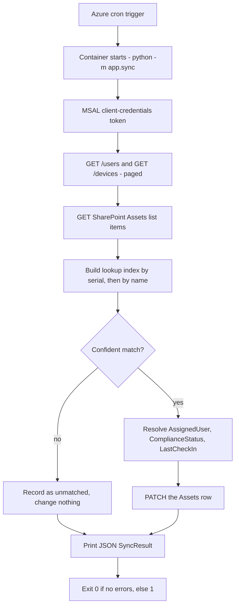
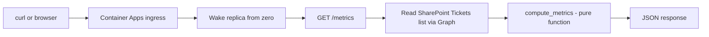

# Architecture

How OpsBridge365's cloud layer is put together, and why each choice was made.

> **Nothing described here is deployed.** The Bicep template compiles and the
> container runs locally, but no Azure resource exists yet — see the status table
> in the [README](../README.md#status). This document describes the design and the
> code that implements it, in the present tense; it does not claim anything is
> running.

---

## Components

| # | Component | Where it lives | What it does |
| --- | --- | --- | --- |
| 1 | `app/config.py` | in the image | Environment-driven settings. Importing it never raises — validation happens on first `get_settings()` call, so tests and `--help`-style imports work with a completely empty environment |
| 2 | `app/graph.py` | in the image | The only thing that talks to Microsoft Graph: MSAL client-credentials auth, `@odata.nextLink` paging, retry/backoff |
| 3 | `app/sharepoint.py` | in the image | Thin wrapper over #2 for list reads and asset PATCH. Deliberately owns no auth, paging or retry logic of its own |
| 4 | `app/sync.py` | Container Apps **Job** | Run-and-exit entrypoint. Fetches, matches, PATCHes, prints a JSON summary, exits with a status code |
| 5 | `app/metrics.py` | Container App (API) | Pure function over ticket rows — no I/O, so it is trivially testable |
| 6 | `app/main.py` | Container App (API) | FastAPI surface: `GET /healthz`, `GET /metrics` |
| 7 | `infra/main.bicep` | Azure ARM | The entire cloud half in one file, resource-group scoped |
| 8 | `.github/workflows/` | GitHub | `ci.yml` on pull requests; `deploy.yml` on push to `main` |

The Azure resources the template declares:

| Resource | Name | Role |
| --- | --- | --- |
| Log Analytics workspace | `opsbridge-logs` | stdout/stderr from both containers, plus job execution history. 30-day retention |
| Container Apps environment | `opsbridge-env` | The runtime both workloads live in |
| Key Vault (RBAC, soft-delete on) | `opsbridge<hash>` | Holds exactly one secret: `graph-client-secret` |
| User-assigned managed identity | `opsbridge-id` | Shared by both workloads. Its only permission anywhere in Azure is *read secret values from that vault* |
| Container Apps **Job** | `opsbridge-sync` | `triggerType: Schedule`, cron `0 */6 * * *` UTC, `replicaTimeout` 1800s, `replicaRetryLimit` 1 |
| Container **App** | `opsbridge-api` | External HTTPS ingress on port 8000, `minReplicas: 0`, `maxReplicas: 1` |

Both containers run at 0.25 vCPU / 0.5 GiB.

---

## Data flow

### The sync job, every 6 hours

The matching step is where the design opinion lives. `build_asset_index` indexes
Assets rows by normalised serial number and by normalised device name; any key
that maps to two different rows is recorded as **ambiguous and removed from the
index entirely**, so it matches nothing. `AssetIndex.lookup` tries serial first,
then name. A device Graph reports without a `serialNumber` property is still
matched if the serial hides in `physicalIds` as `[SerialNumber]:ABC123`, which is
where Graph often puts it.

Everything the sync could not determine is counted and surfaced in the exit
summary: `unmatched_devices`, `unknown_assigned_user`, `unknown_compliance`,
`unknown_last_check_in`. A PATCH failure is appended to `errors`, the loop
continues, and a non-empty `errors` list makes the process exit `1`.

### The metrics API, on request

The three numbers, exactly as `app/metrics.py` computes them:

- **`open_tickets`** — every ticket whose `Status` is not `Resolved`
  (case-insensitive, whitespace-trimmed).
- **`due_within_30min`** — unresolved tickets whose `SLAResolutionDue` falls
  between now and now + 30 minutes.
- **`sla_compliance_7d_pct`** — of tickets resolved in the last 7 days, the share
  where `ResolvedDate <= SLAResolutionDue`, rounded to one decimal. A resolved
  ticket with **no** due date is counted in `resolved_last_7d` but excluded from
  the denominator — never assumed met. When the denominator is zero the value is
  `null`.

`resolved_last_7d` and `sla_measured_last_7d` are both returned, so a consumer can
see how thin the sample is instead of trusting a percentage computed from two
tickets. Naive timestamps are treated as UTC, which is what SharePoint stores.

---

## The two-tenant split

The system spans two Entra tenants, and this is deliberate. The division is not
"dev and prod" — it is **who pays** versus **who can consent**.

| | **School tenant** (institutional) | **OpsBridge365 tenant** (personally owned) |
| --- | --- | --- |
| Owns | The Azure subscription (student credit), the resource group, and every Azure resource in it | The Microsoft 365 data plane: the SharePoint site with the Assets and Tickets lists, and the users and devices Graph reads |
| Also holds | The Power Platform service desk: SharePoint lists, Power Apps, flows, Teams | — |
| App registration | `opsbridge-deploy` — OIDC federated to this repo's `main`, no password, ARM rights on one resource group, **zero Graph permissions** | `opsbridge-graph` — client secret, Graph application permissions, **zero Azure RBAC** |
| Auth model | Workload identity federation (deploy); standard connectors and signed-in user context (service desk) | Application permissions, client credentials |
| Admin rights | None — a student account | Global admin — the tenant was created by, and belongs to, the author |
| Lifetime | Permanent, no trial clock | Entra tenant permanent; the M365 E5 trial that adds SharePoint runs 30 days |

**Why split at all.** Microsoft Graph *application* permissions — the app-only,
no-signed-in-user kind this service needs to run unattended on a cron — require
**tenant admin consent**. An institutional tenant will not grant a student's app
registration `User.Read.All` and `Device.Read.All`, and asking is not a design.
The only way to demonstrate app-only Graph access is to be the admin of the tenant
you are consenting in, which means creating one. Meanwhile the Azure credit lives
with the school account, and student credit is not transferable. So the tenant
that can consent and the tenant that can pay are necessarily different ones, and
each half of the system is registered where it actually belongs.

**Why not just run everything in the own tenant.** The service desk half was built
first, in the institutional tenant, on standard connectors that cost nothing and
never expire. Moving it would trade a permanent home for a 30-day trial clock —
and the Azure subscription could not follow anyway.

**What this costs, stated plainly.** The sync writes to a SharePoint site in the
*own* tenant, not the institutional one. Cross-tenant writes would need admin
consent from the institutional side — the same door that is closed. So the Assets
list is recreated in the own tenant with the same schema, which is what
`scripts/provision_sharepoint.py` exists to do idempotently. Nothing about the
service is tenant-specific: the site id and both list ids are configuration, so
the same image deploys against any tenant that grants consent. That is how a
vendor would ship it.

### Two tenant ids, and why conflating them breaks the deploy

Because the identities live in different directories, **there are two tenant ids
in the pipeline and they are not interchangeable.**

| | Deploy path | Graph runtime path |
| --- | --- | --- |
| Repo secret | `AZURE_TENANT_ID` | `GRAPH_TENANT_ID` |
| Tenant | School (owns the subscription) | OpsBridge365 (owns the Graph app) |
| Consumed by | `azure/login@v2` — and nothing else in the workflow | Bicep `graphTenantId` → container env `AZURE_TENANT_ID` → MSAL authority |

The runtime path ends in `app/config.py`, which builds
`https://login.microsoftonline.com/{azure_tenant_id}` and asks that authority for
a token for `opsbridge-graph`. Feed it the school tenant and the request fails —
that app registration does not exist in that directory — even though the ARM
deployment itself succeeded. It is a silent-until-runtime failure, which is why
the two ids are separate secrets with separate names rather than one value reused
twice. The container's env var is still called `AZURE_TENANT_ID` (the
conventional name for a client-credentials app), but its **value** is the
Microsoft 365 tenant; Bicep's `graphTenantId` parameter is named to make that
unambiguous at the point where the value is actually chosen.

---

## Decision: a run-and-exit Job, not an always-on service

The sync is periodic. It has no state between runs, no queue to drain, and no
reason to hold memory for the 5 hours 59 minutes it is not working.

**What was chosen.** A Container Apps Job with `triggerType: Schedule`. Azure
starts a replica on the cron, the container runs `python -m app.sync` to
completion, prints its summary, and the replica is torn down.

**What was rejected, and why:**

- *An always-on container with APScheduler or a `while True: sleep` loop.* Bills
  continuously for a workload that is busy for seconds a day, and puts the
  schedule inside the image — so changing the cadence means a rebuild and a
  redeploy instead of an infrastructure parameter.
- *`minReplicas: 1` on the API and syncing inside it.* Same cost problem, plus it
  couples a background writer to a request-serving process; a slow Graph page
  would then compete with an HTTP request.

**What it buys.** The cron lives in Azure (`syncCron`, a Bicep parameter), the
image needs no scheduler dependency at all, and idle time bills nothing. The job
is also directly runnable on demand — `az containerapp job start` — which is
exactly what a demo and an incident both need.

**What it costs.** Cold start on every run, and no in-process state between runs.
Neither matters for a job that talks to a REST API and finishes in seconds.
`replicaTimeout: 1800` caps a hung Graph call at 30 minutes; `replicaRetryLimit: 1`
means a failed sync gets one retry and then waits for the next tick rather than
looping — the sync is idempotent (PATCH by list item id), so a missed run is
corrected by the next one.

## Decision: a scale-to-zero API, not an always-on one

`minReplicas: 0`, `maxReplicas: 1`, with an HTTP scale rule at 20 concurrent
requests. The API sleeps when nobody is asking. The first request after idle pays
a cold start of a few seconds.

For a portfolio service that is called during a demo and an interview, that
trade is obviously right: idle is the normal state, and the cold start is
narratable as the feature it is. For a service desk dashboard polled every 30
seconds it would be wrong, and the fix is one line — `minReplicas: 1` — at the
cost of a continuously billed replica.

`maxReplicas: 1` is a cost guardrail, not a capacity estimate. There is no traffic
to size against, and one replica of a read-only API that fans out to Graph is
plenty; raising it is a parameter change if that ever stops being true.

## Decision: GHCR, not Azure Container Registry

**Cost.** Azure Container Registry has no free tier — Basic is a fixed monthly
charge whether or not anything is pulled. It would be the *only* recurring cost in
an architecture otherwise designed to sit at $0, and it would buy nothing this
project needs.

GitHub Container Registry is free for public images on a public repository. The
image is already built by GitHub Actions from a public repo, so it is pushed with
the built-in `GITHUB_TOKEN` — no personal access token to create, rotate or leak,
and no registry credential stored anywhere.

**The second-order win.** A *public* GHCR package needs no pull credentials at
all, so `infra/main.bicep` has no `registries:` block, no registry password in Key
Vault, and no image-pull secret to manage. Removing a cost also removed a
credential.

**The trade.** The image is public — anyone can pull it. It contains no secrets
(verified: no `.env`, no credentials in any `ARG`/`ENV`, configuration arrives at
runtime), so the exposure is the application code, which is public anyway. A
private product would use ACR with a managed-identity pull and accept the bill.

## Decision: one image, two entrypoints

The API and the job share `app/graph.py`, `app/sharepoint.py`, `app/models.py` and
`app/config.py`. Splitting them into two images would double the build, double the
push, and let the two halves drift on a shared client library. Instead the
Dockerfile's `CMD` starts uvicorn, and the Job's container definition overrides
`command`/`args` to `python -m app.sync`. One build, one push, two workloads,
guaranteed identical dependencies.

## Decision: Key Vault for one secret, plain env vars for the rest

The tenant id, client id, site id and both list ids are **identifiers, not
credentials**, and they are plain environment variables in the container
definition. Putting them in Key Vault would add operations, cost and indirection
without adding protection.

The client secret is the one real credential, and it is the one thing in the
vault. It reaches the container as a Key Vault *reference* resolved by the
user-assigned managed identity at replica start — never inlined into the container
definition, never emitted as a deployment output. Details in
[`SECURITY.md`](SECURITY.md).

---

## What I would change with more time or a real budget

- **Drop the client secret entirely.** A managed identity with federated
  credentials against Graph removes the last stored password in the system. It was
  not done here because it needs a live tenant to configure and test.
- **Delta queries.** `list_users` and `list_devices` fetch everything on every
  run. Graph's `/delta` endpoints would fetch only what changed — irrelevant at
  tens of devices, essential at thousands.
- **Intune device data.** `isCompliant` on a directory device object is coarse.
  `deviceManagement/managedDevices` has far richer compliance and check-in data,
  and needs an Intune licence.
- **A real dashboard.** `/metrics` returns JSON. A Power BI or Teams surface on
  top of it is a presentation problem, not an architecture one.
